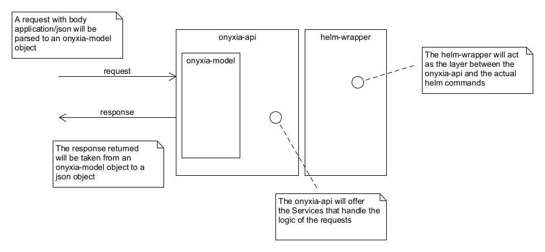

# Onyxia API Architecture

 (back to <a href='./README.md'>Onyxia API Documentation</a>) 

## Overview
Onyxia's API is stateless in itself, using Keycloak for users management and helm for infrastructure management. It was built using [Spring Framework](https://spring.io/), it is recommended to use [Maven](https://maven.apache.org/) to test and build the application, given the already generated `pom.xml` files. 

For a better understanding, this is a high-level scheme for the current API implementation:

The `onyxia-api` package handles the requests, with both the body of the request and the response translated into an `onyxia-model` object. In the background, the `helm-wrapper` creates the interface from the `onyxia-api` to the true service manager ([Helm](https://helm.sh/)).

## Architecture
The project architecture is divided in three packages, where `helm-wrapper` and `onyxia-model` are imported to the Spring Boot application in `onyxia-api`.
- `helm-wrapper`: package to handle interactions with [Helm](helm.sh), with all associated tests.
    - `src/main/java/io/github/inseefrlab/helmwrapper`: the `helm-wrapper` package java source code.
        - `configuration`: configuration class of the `helm-wrapper`, namely endpoint, Kubernetes token, etc.
        - `model`: models to support the `helm` request and response structures.
        - `service`: service logics for interaction with `helm`.
        - `utils`: static methods utilities for the creation of a `helm` command.
    - `src/main/resources`: the default application properties.
    - `src/test/java/io/github/inseefrlab/helmwrapper`: the `helm-wrapper` tests code.
- `onyxia-model`: package to hold information about Onyxia elements, with all associated tests.
    - `src/main/java/fr/insee/onyxia/model`
        - `catalog`: models the Onyxia catalog related object, namely, (helm) packages available to install, a list of packages, and other Onyxia catalog configurations.
        - `dto`: Data Transfer Object definitions for the listing, creation and uninstalling of Services from the Catalog.
        - `helm`: models that extend Onyxia catalog objects when the provider is helm.
        - `project`: model for the concept of Project, to which users belong to, and related with one Group of services.
        - `region`: model for the concept of Region, that is an input configuration of the Onyxia API.
        - `service`: models related with Services, which are launched instances of (helm) packages.
        - `services/quota`: models related with the user quota in the Kubernetes namespace.
    - `src/test`: the `onyxia-model` tests code.
- `onyxia-api`: main module for the REST API application (Onyxia API), exposes endpoints, computes logic, uses `onyxia-model` for objects, and uses `helm-wrapper` for Helm service calls.
    - `src/main/java/fr/insee/onyxia/api`
        - `configuration`: configuration classes for our Bean production.
        - `controller`: REST controllers to manage health check, API requests, and route them to the correct service logic.
        - `dao`: *legacy code*
        - `openapi`: open API specification configuration.
        - `security`: security configurations, for deployment with (`SpringKeycloakSecurityConfiguration`) and without (`NoSecurityConfiguration`) an authentication provider.
        - `services`: logic behind the API requests.
        - `user`: service for the user providing.   
    - `src/main/resources`: the default application properties, Catalog and Region configurations.
    - `src/test`: the `onyxia-api` tests code.

