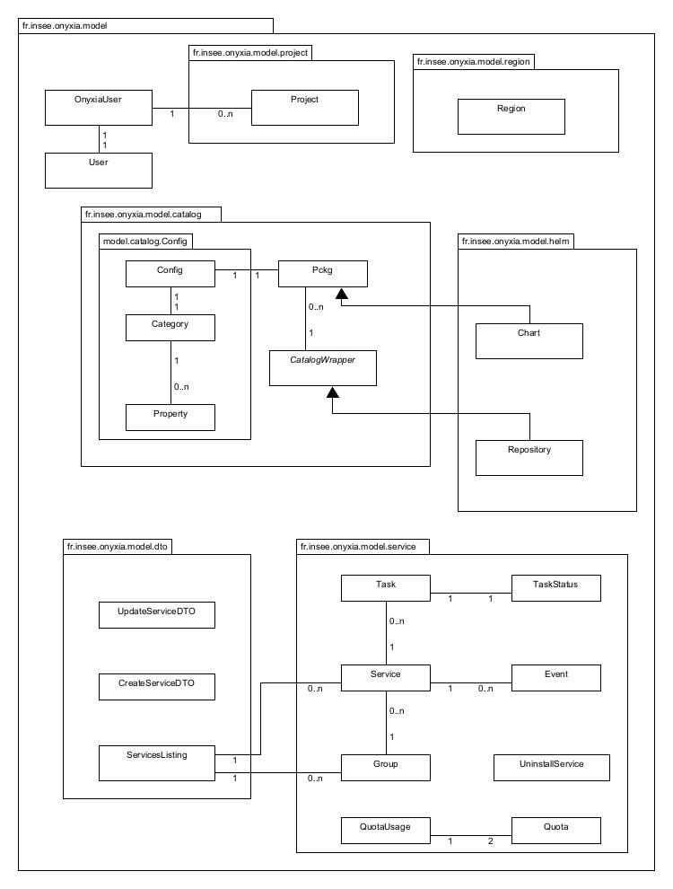

# Onyxia API Specification
<p style="text-align: right;"> (back to <a href='./README.md'>Onyxia API Documentation</a>) <p>


## Table of Contents
1. [Terminology](#terminology)
2. [Endpoints](#endpoints)
3. [Data model](#data-model)

## Terminology

The following documentation will have mentions to the different packages, classes and concepts with the subsequent terminology.  

The packages they will be referred as:
- `onyxia-api`: refers to the package `fr.insee.onyxia.api` that exposes the endpoints and handles the requests, with source code under `onyxia-api/src/`.
- `onyxia-model`: refers to the package `fr.insee.onyxia.model` that structures the request and response body into Java objects, with the source code under `onyxia-model/src/`.
- `helm-wrapper`: refers to the package `io.github.inseefrlab.helmwrapper` that creates a Java interface to the machine's [Helm](https://helm.sh/) binary, with the source code under `helm-wrapper/src/` (to be moved to a different repository as a standalone package).

Classes will be either referred with their fully qualified class name, e.g., the user controller in `onyxia-api` is handled by the class `fr.insee.onyxia.api.controller.api.user.UserController` , or a combination of their name and the package, e.g., `UserController` from `onyxia-api`. A reference to the source code file is also possible to appear if a class is mentioned.

The concepts terminology is the following:
- *Region*: the configuration block for the deployment of Onyxia, it was originally created when migrating Onyxia from Marathon (Mesos DC/OS) to Kubernetes.
- *Service*: a package that can be installed in behalf of an user, so that the later can freely use it as his own.
- *Task*: a component of the Service that runs the logic, i.e., translated to a Pod within Kuberenetes.
- *Catalog*: a compilation of Services that are available for launching by Onyxia.
- *Group*: the grouping of Services for a Project, which the underlying translation of the concept is a Kubernetes namespace where the services are launched.
- *Project*: the logical construct of a group of users, with a one-to-one relationship with a Group, i.e., each project has its own Kubernetes namespace.
- *Quota*: the request and limitation of resources per user (or group) namespace.


## Endpoints 
This endpoints specification is covered in the Open API Specification document accessible in the `/api/` endpoint. In this documentation we go into further detail with explanation of utility and backend processes.

### Headers
For authenticated requests the headers, besides the `Authorization` header, the `ONYXIA-REGION` and `ONYXIA-PROJECT` can be set:
- `ONYXIA-REGION`: defines which region the API should do requests to, defaults to the first region in the API configuration.
- `ONYXIA-PROJECT`: defines the namespace (Project) for the request, defaults to the user's personal project.


### User

**Request**
```
GET /user/info
```

**Response**  
If successfully authenticated, the user has access to his own information recieving an `HTTP/ 200 OK`, recieving the response body with the following structure.
```json
{
  "email": "string",
  "idep": "string",
  "nomComplet": "string",
  "ip": "string",
  "groups": [
    "string",
  ],
  "projects": [
    {
      "id": "string",
      "group": "string",
      "bucket": "string",
      "namespace": "string",
      "name": "string"
    },
  ]
}
```

If the user is not authenticated, he will recieve an `HTTP/ 401 Unauthorized`.


**Backend**  
The controller in the backend is implemented by the `fr.insee.onyxia.api.controller.api.user.UserController` class, and with the handling logic implemented in the class `fr.insee.onyxia.api.user.OnyxiaUserProvider`. The class `fr.insee.onyxia.model.OnyxiaUser` will define response body object structure.

### My Lab
My Lab endpoints are available to authenticated users, offering a programmatic way to manage the available services in Onyxia.

**Request**  
```
GET /my-lab/app?serviceId=:string
```
Given its `serviceId`, requests a description of a specific service that was launched through Onyxia.

**Response**  
Returns the service description in an `application/json` format.
```json
{
  "id": "string",
  "name": "string",
  "instances": 0,
  "cpus": 0,
  "mem": 0,
  "status": "string",
  "type": "string",
  "urls": [
    "string"
  ],
  "internalUrls": [
    "string"
  ],
  "logo": "string",
  "env": {
    "additionalProp1": "string",
    "additionalProp2": "string",
    "additionalProp3": "string"
  },
  "tasks": [
    {
      "id": "string",
      "status": {
        "status": "string",
        "reason": "string"
      },
      "containers": [
        {
          "name": "string",
          "ready": true
        }
      ]
    }
  ],
  "events": [
    {
      "message": "string",
      "timestamp": 0
    }
  ],
  "subtitle": "string",
  "monitoring": {
    "URLPattern": "string"
  },
  "postInstallInstructions": "string",
  "startedAt": 0,
  "labels": {
    "additionalProp1": "string",
    "additionalProp2": "string",
    "additionalProp3": "string"
  }
}
```
**Backend**  
The controller is handled by `fr.insee.onyxia.api.controller.api.mylab.MyLabController`, with the logic ran by the `fr.insee.onyxia.api.services.AppsService` interface implemented by the `fr.insee.onyxia.api.services.impl.HelmAppsService` class, returning an object `fr.insee.onyxia.model.service.Service`. 

**Request**  
```
PUT /my-lab/app
...
Content-Type: application/json
...
```
Request a service to be launched on behalf of the user, with the request body in the following format.
```json
{
  "catalogId": "string",
  "packageName": "string",
  "packageVersion": "string",
  "name": "string",
  "options": {},
  "dryRun": true
}
```
**Response**  
Returns `HTTP/ 200 OK` and the manifest of the installed service, if completed successfully.

**Backend**  
The controller is handled by `fr.insee.onyxia.api.controller.api.mylab.MyLabController`, with the logic ran by the `fr.insee.onyxia.api.services.AppsService` interface implemented by the `fr.insee.onyxia.api.services.impl.HelmAppsService` class. In the backend it uses the `helm-wrapper` package to install a service package from one of the registered catalogs.


**Request**  
```
DELETE /my-lab/app?path=:string&bulk=:boolean
```
Request to delete a specific service launched through Onyxia on the namespace (`bulk=false`), or every service launched in that namespace (`bulk=true`).

**Response**  
Returns `HTTP/ 200 OK`, and if the deletion of the service(s) was a success or not.
```json
{
  "path": "string",
  "success": true
}
```

**Backend**  
The controller is handled by `fr.insee.onyxia.api.controller.api.mylab.MyLabController`, with the logic ran by the `fr.insee.onyxia.api.services.AppsService` interface implemented by the `fr.insee.onyxia.api.services.impl.HelmAppsService` class. In the backend it uses the `helm-wrapper` package to uninstall a service launched by helm.


**Request**  
```
GET /my-lab/app/logs?serviceId=:string&taskId=:string
```
To request the logs produced by one of the pods, given a `serviceId` and a `taskId`, both can be obtainable through a `/my-lab/services` call.

**Response**  
Returns a raw string with the logs of the pod.
```
string...
```
**Backend**  
The controller is handled by `fr.insee.onyxia.api.controller.api.mylab.MyLabController`, with the logic ran by the `fr.insee.onyxia.api.services.AppsService` interface implemented by the `fr.insee.onyxia.api.services.impl.HelmAppsService` class.


**Request**  
```
GET /my-lab/services?groupId=:string
```
Requests the launched services on the user namespace. *CURRENTLY groupId is not supported, it will return an empty list. Use the `ONYXIA-PROJECT` header for a Project's service list*.


**Response**  
Returns a list of services installed in the user namespace.
```json
{
  "apps": [
    {
      "id": "string",
      "name": "string",
      "instances": 0,
      "cpus": 0,
      "mem": 0,
      "status": "DEPLOYING",
      "type": "KUBERNETES",
      "urls": [
        "string"
      ],
      "internalUrls": [
        "string"
      ],
      "logo": "string",
      "env": {
        "additionalProp1": "string",
        "additionalProp2": "string",
        "additionalProp3": "string"
      },
      "tasks": [
        {
          "id": "string",
          "status": {
            "status": "string",
            "reason": "string"
          },
          "containers": [
            {
              "name": "string",
              "ready": true
            }
          ]
        }
      ],
      "events": [
        {
          "message": "string",
          "timestamp": 0
        }
      ],
      "subtitle": "string",
      "monitoring": {
        "URLPattern": "string"
      },
      "postInstallInstructions": "string",
      "startedAt": 0,
      "labels": {
        "additionalProp1": "string",
        "additionalProp2": "string",
        "additionalProp3": "string"
      }
    }
  ],
  "groups": [
    {
      "id": "string",
      "apps": [
        {
          "id": "string",
          "name": "string",
          "instances": 0,
          "cpus": 0,
          "mem": 0,
          "status": "DEPLOYING",
          "type": "KUBERNETES",
          "urls": [
            "string"
          ],
          "internalUrls": [
            "string"
          ],
          "logo": "string",
          "env": {
            "additionalProp1": "string",
            "additionalProp2": "string",
            "additionalProp3": "string"
          },
          "tasks": [
            {
              "id": "string",
              "status": {
                "status": "string",
                "reason": "string"
              },
              "containers": [
                {
                  "name": "string",
                  "ready": true
                }
              ]
            }
          ],
          "events": [
            {
              "message": "string",
              "timestamp": 0
            }
          ],
          "subtitle": "string",
          "monitoring": {
            "URLPattern": "string"
          },
          "postInstallInstructions": "string",
          "startedAt": 0,
          "labels": {
            "additionalProp1": "string",
            "additionalProp2": "string",
            "additionalProp3": "string"
          }
        }
      ]
    }
  ]
}
```
**Backend**  
The controller is handled by `fr.insee.onyxia.api.controller.api.mylab.MyLabController`, with the logic ran by the `fr.insee.onyxia.api.services.AppsService` interface implemented by the `fr.insee.onyxia.api.services.impl.HelmAppsService` class. In the backend it uses the `helm-wrapper` package to list the installed services.


**Request**  
```
GET /my-lab/quota
```
**Response**  
Returns the quota specifications and the current quota usage of the namespace.  
```json
{
  "spec": {
    "requests.memory": "string",
    "requests.cpu": "string",
    "limits.memory": "string",
    "limits.cpu": "string",
    "requests.storage": "string",
    "count/pods": 0
  },
  "usage": {
    "requests.memory": "string",
    "requests.cpu": "string",
    "limits.memory": "string",
    "limits.cpu": "string",
    "requests.storage": "string",
    "count/pods": 0
  }
}
```

**Backend**  
The controller is handled by `fr.insee.onyxia.api.controller.api.mylab.QuotaController`, with the implementation logic ran by `fr.insee.onyxia.api.services.impl.kubernetes.KubernetesService` where it fetches the quotas from the user (or group) namepsace with the name `onyxia-quota`, and returns an object built from the model class `fr.insee.onyxia.model.service.quota.QuotaUsage`.


**Request**  
```
POST /my-lab/quota
...
Content-Type: application/json
...
```
With the request body with the following structure.
```json
{
  "requests.memory": "string",
  "requests.cpu": "string",
  "limits.memory": "string",
  "limits.cpu": "string",
  "requests.storage": "string",
  "count/pods": 0
}
```
**Response**  
If successfully authenticated, and the Onyxia configuration allows it (change quota request enabled), the response will be a `HTTP/ 200 OK` and the new quota to the namepsace will be applied. Failing to authenticate there will be a `HTTP/ 4xx`.  

**Backend**  
The controller is handled by `fr.insee.onyxia.api.controller.api.mylab.QuotaController`, with the implementation logic ran by `fr.insee.onyxia.api.services.impl.kubernetes.KubernetesService` where it applies the newly requested quota to the user (or group) namepsace with the name `onyxia-quota` based on the recieved request with object of the class `fr.insee.onyxia.model.service.quota.Quota`. For this request to happen, first it is necessary that the quota feature is enabled in the Onyxia configuration, and the quota modification is also enabled. With those two checked, the `KubernetesService` first fetches the namespace, and creates one if none was created for the user yet, and then applies the quota.


**Request**  
```
POST /my-lab/quota/reset
```
**Response**  
If successfully authenticated, and the Onyxia configuration allows it (change quota request enabled), the response will be a `HTTP/ 200 OK` and the quota will be reset to the default quota in namepsace. Failing to authenticate there will be a `HTTP/ 4xx`.  

**Backend**  
The controller is handled by `fr.insee.onyxia.api.controller.api.mylab.QuotaController`, with the implementation logic ran by `fr.insee.onyxia.api.services.impl.kubernetes.KubernetesService`.


### Cloudshell

```
GET /cloudshell?region=:object&project=:object
```

### Onboarding

**Request**  
*NOTE: this onboarding process is being done behind the scenes when requesting a first service, and the endpoint use is not the default behaviour.*  

The request to onboard process entails the creation of the Kubernetes namespace for the Group and the creation of a RoleBinding to that namespace giving the default ServiceAccount of that namespace admin permissions. There is a check in whether the user that made the request belongs to the group, based on the OIDC token, and the group onboarding process is triggered if so.

If no group is given in the body, it is assumed that it is a user onboard, i.e., a namespace for a single user rather than a Group (Project), and the creation of the namespace and RoleBinding remains the same. However, in the user use-case, there is also the possibility to set Quotas on the namespace during creation, and these are obtained in the Region definition configuration.

```
POST /onboarding
...
Content-Type: application/json
...
```
```json
{
  "group": "string"
}
```
**Response**  
If there is no group the onboard of the user is complete and a `HTTP/ 200 OK` response is returned.  
If the user belongs to the group the onboard process is complete and a `HTTP/ 200 OK` response is returned.  
If the user does not belong to the group the onboard process fails and a `HTTP/ 500 Internal Server Error` response is returned, due to an `AccessDeniedException`.  
If the user is not authenticated a `HTTP/ 405 Not Allowed` response is returned.  

**Backend**  
This controller in the backend is implemented by the `fr.insee.onyxia.api.controller.api.onboarding.OnboardingController`, with the logic implemented in both `fr.insee.onyxia.api.services.UserProvider` and `fr.insee.onyxia.api.services.impl.kubernetes.KubernetesService` classes.

### Public
Public endpoints are available to all, offering a programmatic way to comprehend the current configuration and the available services in Onyxia.

**Request**  
```
GET /public/regions
```
**Response**  
Returns a list of Regions, the configuration blocks of Onyxia API.
```json
[
  {
    "id": "string",
    "name": "string",
    "description": "string",
    "location": {
      "lat": 0,
      "name": "string",
      "long": 0
    },
    "services": {
      "type": "KUBERNETES",
      "singleNamespace": true,
      "namespacePrefix": "string",
      "groupNamespacePrefix": "string",
      "usernamePrefix": "string",
      "groupPrefix": "string",
      "authenticationMode": "impersonate",
      "expose": {
        "domain": "string"
      },
      "monitoring": {
        "URLPattern": "string"
      },
      "cloudshell": {
        "catalogId": "string",
        "packageName": "string"
      },
      "initScript": "string",
      "quotas": {
        "enabled": true,
        "allowUserModification": true,
        "default": {
          "requests.memory": "string",
          "requests.cpu": "string",
          "limits.memory": "string",
          "limits.cpu": "string",
          "requests.storage": "string",
          "count/pods": 0
        }
      },
      "defaultConfiguration": {
        "networkPolicy": true,
        "ipprotection": true
      }
    },
    "onyxiaAPI": {
      "baseURL": "string"
    },
    "data": {
      "S3": {
        "monitoring": {
          "URLPattern": "string"
        },
        "URL": "string"
      }
    }
  }
]
```
**Backend**  
This controller in the backend is implemented by the `fr.insee.onyxia.api.controller.pub.RegionsController` class, the logic handled by the class `fr.insee.onyxia.api.configuration.properties.RegionsConfiguration`, and the model for a region block is translated in the `fr.insee.onyxia.model.region.Region` class.

**Request**  
```
GET /public/ip
```
**Response**  
Return the IP addresses of the service caller if it exist on the forwarding headers, otherwise it returns the remote address of the servlet request.
```json
{
  "ip": "string"
}
```

**Backend**  
The controller in the backend is implemented by the `fr.insee.onyxia.api.controller.pub.IPController` class, and with the handling logic implemented in the class `fr.insee.onyxia.api.services.utils.HttpRequestUtils`.

**Request**  
```
GET /public/healthcheck
```
**Response**  
Will return `HTTP/ 200 OK` if service is healthy.

**Backend**  
The request is handled solely by `fr.insee.onyxia.api.controller.pub.HealthcheckController`.

**Request**  
```
GET /public/configuration
```
**Response**  
Returns the configuration of the current deployment of the Onyxia API, including the version of the Spring Boot API, timestamp at which it was built, as well as Regions configuration list.
```json
{
  "build": {
    "version": "string",
    "timestamp": 0
  },
  "regions": [
    {
      "id": "string",
      "name": "string",
      "description": "string",
      "location": {
        "lat": 0,
        "name": "string",
        "long": 0
      },
      "services": {
        "type": "KUBERNETES",
        "singleNamespace": true,
        "namespacePrefix": "string",
        "groupNamespacePrefix": "string",
        "usernamePrefix": "string",
        "groupPrefix": "string",
        "authenticationMode": "impersonate",
        "expose": {
          "domain": "string"
        },
        "monitoring": {
          "URLPattern": "string"
        },
        "cloudshell": {
          "catalogId": "string",
          "packageName": "string"
        },
        "initScript": "string",
        "quotas": {
          "enabled": true,
          "allowUserModification": true,
          "default": {
            "requests.memory": "string",
            "requests.cpu": "string",
            "limits.memory": "string",
            "limits.cpu": "string",
            "requests.storage": "string",
            "count/pods": 0
          }
        },
        "defaultConfiguration": {
          "networkPolicy": true,
          "ipprotection": true
        }
      },
      "onyxiaAPI": {
        "baseURL": "string"
      },
      "data": {
        "S3": {
          "monitoring": {
            "URLPattern": "string"
          },
          "URL": "string"
        }
      }
    }
  ]
}
```
**Backend**  
The controller in the backend is implemented by the `fr.insee.onyxia.api.controller.pub.ConfigurationController` class. The logic behind the Regions configuration is implemented in the class `fr.insee.onyxia.api.configuration.properties.RegionsConfiguration` with a list of Regions based on the class `fr.insee.onyxia.model.region.Region`.

**Request**  
```
GET /public/catalog
```
**Response**  
Returns a list of catalogs associated with this Onyxia API.
```json
{
  "catalogs": [
    {
      "catalog": {
        "packages": ["objects"],
        "apiVersion": "string",
        "generated": "string"
      },
      "id": "string",
      "name": "string",
      "description": "string",
      "maintainer": "string",
      "location": "string",
      "status": "string",
      "lastUpdateTime": 0,
      "scm": "string",
      "type": "string"
    }
  ]
}
```
**Backend**  
The controller in the backend is implemented by the `fr.insee.onyxia.api.controller.pub.CatalogController` class. Whereas the logic is handled by the interface `fr.insee.onyxia.api.services.CatalogService` implemented by `fr.insee.onyxia.api.services.impl.CatalogServiceImpl`, which fetches the `fr.insee.onyxia.api.configuration.Catalogs`, list of available `fr.insee.onyxia.api.configuration.CatalogWrapper`, which in turn uses the model `fr.insee.onyxia.model.catalog.CatalogWrapper`, that were loaded at startup with `fr.insee.onyxia.api.configuration.CatalogsLoader`.

**Request**  
```
GET /public/catalog/:catalogId
```
**Response**  
Returns a complete catalog with all its packages, fetched by his id.
```json
{
  "catalog": {
    "packages": ["objects"],
    "apiVersion": "string",
    "generated": "string"
  },
  "id": "string",
  "name": "string",
  "description": "string",
  "maintainer": "string",
  "location": "string",
  "status": "PROD",
  "lastUpdateTime": 0,
  "scm": "string",
  "type": "string"
}
```
**Backend**  
The controller in the backend is implemented by the `fr.insee.onyxia.api.controller.pub.CatalogController` class. In turn, the logic is handled by the interface `fr.insee.onyxia.api.services.CatalogService` implemented by `fr.insee.onyxia.api.services.impl.CatalogServiceImpl`, that fetches a single catalog `fr.insee.onyxia.api.configuration.CatalogWrapper` by its ID from the list of available catalogs in `fr.insee.onyxia.api.configuration.Catalogs`. The catalog itself is represented with the model `fr.insee.onyxia.model.catalog.CatalogWrapper`.

**Request**  
```
GET /public/catalog/:catalogId/:packageName
```
**Response**  
Returns a package specification from a catalog, fetched by their ids.
```json
{
  "name": "string",
  "description": "string",
  "version": "string",
  "config": {
    "type": "string",
    "properties": {
      "description": "string",
      "type": "string",
      "required": [
        "string"
      ]
    },
    "required": [
      "string"
    ]
  }
}
```
**Backend**  
The controller in the backend is implemented by the `fr.insee.onyxia.api.controller.pub.CatalogController` class. In turn, the logic is handled by the interface `fr.insee.onyxia.api.services.CatalogService` implemented by `fr.insee.onyxia.api.services.impl.CatalogServiceImpl`, that fetches a single package from a single catalog in `fr.insee.onyxia.api.configuration.CatalogWrapper`. The package itself is represented with the model `fr.insee.onyxia.model.catalog.Pkg`, with each package having their own config `fr.insee.onyxia.model.catalog.Config.Config`.

## Data model
### Class diagram
The relationship between the different request objects is represented in the following class diagram.



